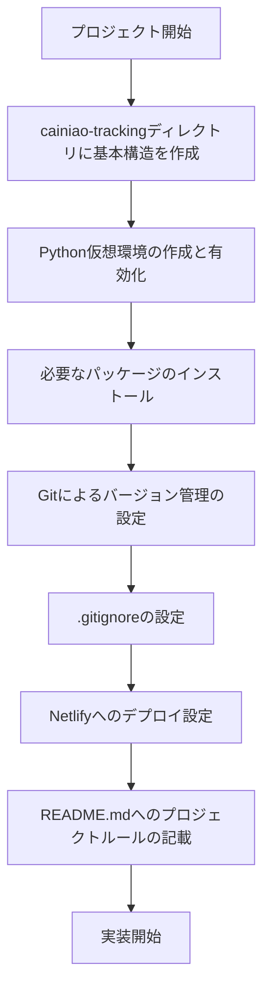

# Cainiao-Tracking Webアプリ

## プロジェクト概要
荷物の追跡番号と品名を登録すると、最新の現在状況と進捗状況履歴が表示されるWebアプリ。

## 使用技術
- フロントエンド：HTML, CSS, JavaScript
- バーンド：Python (FlaskまたはFastAPI)
- デプロイ：Netlify
- バージョン管理：Git

## プロジェクト構成
- `index.html`：ユーザーインターフェース
- `static/css/style.css`：スタイルシート
- `static/js/script.js`：クライアントサイドのロジック
- `app.py`：FlaskまたはFastAPIを使用したAPIサーバー
- `requirements.txt`：Python依存関係のリスト

## 実装計画
1. `cainiao-tracking`ディレクトリに基本構造を作成
2. Python仮想環境の作成と有効化
3. Gitによるバージョン管理の設定
4. Netlifyへのデプロイ設定
5. 実装開始

### 詳細なステップ

## ルール
- プロジェクトは`cainiao-tracking`ディレクトリ内で行う。
- Pythonを使用する場合は仮想環境`venv`を有効にする。
- Gitでバージョン管理を行う。
- デプロイはNetlifyを使用する。